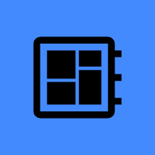
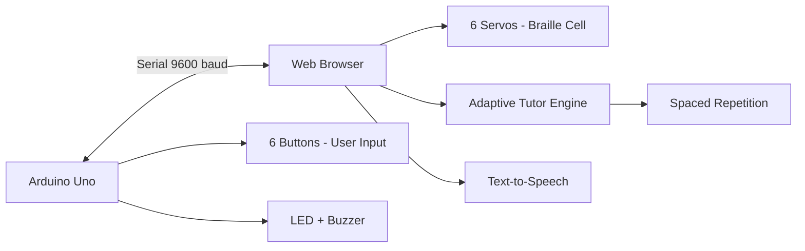
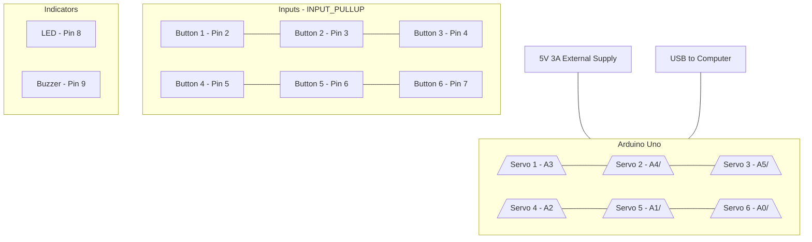
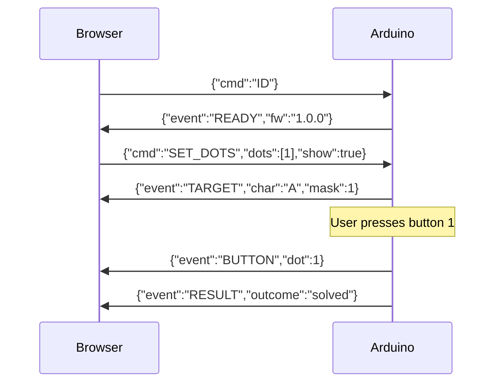

# Braille Tutor

An interactive Braille learning device with an AI-driven adaptive tutor, animated web dashboard, and tactile 6-dot Braille cell. Practice and test modes adjust to your weak symbols using spaced repetition, while Text-to-Speech provides voice instructions for every letter, number, and contraction.



## Table of Contents

- [Overview](#overview)
- [Hardware](#hardware)
- [Architecture](#architecture)
- [Project Structure](#project-structure)
- [Quick Start](#quick-start-clone--run)
- [Firmware Upload](#firmware-upload)
- [Using the App](#using-the-app)
- [Calibration](#calibration)
- [Keyboard Shortcuts](#keyboard-shortcuts)
- [Audio System](#audio-system)
- [Mistakes We Made](#mistakes-we-made)
- [Troubleshooting](#troubleshooting)
- [License & Credits](#license--credits)

## Overview

Braille Tutor is a full-stack IoT educational device. A physical Braille cell built with an Arduino Uno and 6 servos raises and lowers dots to form letters. Learners press physical buttons to replicate the pattern. A Svelte web dashboard connects via Web Serial API, provides animated visual feedback, tracks progress with an adaptive engine, and speaks instructions aloud.

### How it works at a glance



## Hardware

### Bill of Materials

| Component | Quantity | Notes |
|-----------|----------|-------|
| Arduino Uno | 1 | Or compatible ATmega328P board |
| SG90 Micro Servo | 6 | For Braille dots |
| Pushbutton | 6 | Momentary, normally open |
| LED | 1 | Any color, with 220 ohm resistor |
| Piezo Buzzer | 1 | Active or passive |
| 5V 3A Power Supply | 1 | External, for servos |
| Breadboard + Jumper Wires | - | - |
| USB Cable | 1 | Data-capable (not charge-only) |

### Pin Mapping

| Function | Arduino Pin | Notes |
|----------|-------------|-------|
| Servo Dot 1 | A3 | HIGH=50, LOW=0 |
| Servo Dot 2 | A4 | HIGH=50, LOW=0 |
| Servo Dot 3 | A5 | HIGH=50, LOW=0 |
| Servo Dot 4 | A2 | HIGH=20, LOW=70 |
| Servo Dot 5 | A1 | HIGH=30, LOW=80 |
| Servo Dot 6 | A0 | HIGH=30, LOW=80 |
| Button Dot 1 | 2 | INPUT_PULLUP |
| Button Dot 2 | 3 | INPUT_PULLUP |
| Button Dot 3 | 4 | INPUT_PULLUP |
| Button Dot 4 | 5 | INPUT_PULLUP |
| Button Dot 5 | 6 | INPUT_PULLUP |
| Button Dot 6 | 7 | INPUT_PULLUP |
| LED | 8 | Through 220 ohm resistor |
| Buzzer | 9 | Positive pin |

### Braille Dot Layout

The standard 6-dot Braille cell uses this layout:

```
1 4
2 5
3 6
```

Dots are numbered 1-6. Letters are formed by raising specific combinations. For example, letter A uses dot 1 only, letter B uses dots 1 and 2.

### Servo Angle Calibration

Each servo has unique HIGH/LOW angles due to mechanical variance:

| Servos | HIGH (raised) | LOW (lowered) |
|--------|---------------|---------------|
| 1, 2, 3 | 50 | 0 |
| 4 | 20 | 70 |
| 5, 6 | 30 | 80 |

### Wiring Diagram



### Power Warning

Do NOT power 6 servos from the Arduino 5V pin. Six SG90 servos can draw 1.5A-2.5A peak stall current, which will brown-out/reset the Uno. Always use an external 5V 3A supply with common ground.

## Architecture

### Communication Protocol

The browser and Arduino communicate via newline-terminated JSON lines at 9600 baud.

**Browser to Arduino (Commands):**

| Command | Payload | Description |
|---------|---------|-------------|
| ID | none | Get firmware info |
| SET_DOTS | dots: number[] | Raise specific dots (1-6) |
| SET_TARGET | char: string, show: bool | Display a letter |
| MODE | mode: PRACTICE or TEST | Change mode |
| SIM_PRESS | dot: number | Simulate button press |
| CLEAR | none | Lower all dots |
| RESET | none | Reset target counters |

**Arduino to Browser (Events):**

| Event | Payload | Description |
|-------|---------|-------------|
| READY | fw, board, mode | Firmware ready |
| TARGET | char, mask, shown | Pattern displayed |
| DOT_OK | dot, remaining | Correct dot pressed |
| RESULT | outcome, attempts, misses, time_ms | Pattern solved/failed |
| BUTTON | dot | Raw button press |
| MODE | mode | Mode changed |

### Data Flow



### Tech Stack

| Layer | Technology |
|-------|------------|
| Frontend | Svelte 5 + Vite + TypeScript |
| Firmware | Arduino C++ (Servo.h) |
| Communication | Web Serial API |
| Animation | Lottie (lottie-web) |
| Audio | Web Speech API + WAV playback |
| Styling | CSS (Min-UI design principles) |

## Project Structure

```
Braille/
|-- index.html                 # Main HTML entry point
|-- vite.config.ts             # Vite configuration
|-- tsconfig.json              # TypeScript config
|-- tools/
|   |-- hwtest.sh              # Hardware test script
|-- src/
|   |-- index.ts               # Main app logic, serial, events
|   |-- braille.ts             # Braille alphabet data, dot mapping
|   |-- lottie.ts              # Lottie animation loader
|   |-- style.css              # All styles
|-- public/
|   |-- audio-alphabet/        # A-Z WAV files
|   |-- audio-numbers/         # 0-1000 WAV files
|   |-- audio-modes/           # practice/test/alphabet/numbers MP3
|   |-- images/                # Icons and favicon
|-- firmware/
|   |-- braille_tutor/
|       |-- braille_tutor.ino  # Arduino sketch
```

## Quick Start (Clone & Run)

### Prerequisites

- Node.js 18+ and npm
- Arduino IDE (for firmware upload)
- Chrome or Edge browser (Web Serial API requirement)
- Arduino Uno + hardware (see Bill of Materials)

### Step 1: Clone the Repository

```bash
git clone https://github.com/yourusername/braille-tutor.git
cd braille-tutor
```

### Step 2: Install Dependencies

```bash
npm install
```

### Step 3: Copy Audio Files

The audio files live in `audio-alphabet/` and `audio-numbers/` at the project root. Copy them to `public/` so Vite serves them:

```bash
cp -r audio-alphabet public/audio-alphabet
cp -r audio-numbers public/audio-numbers
```

If you have your own audio files, place WAV files in `public/audio-alphabet/` named `A.wav` through `Z.wav` and `public/audio-numbers/` named `0.wav`, `1.wav`, etc.

### Step 4: Start the Dev Server

```bash
npm run dev
```

Output:
```
VITE v5.x.x  ready in xxx ms

  Local: http://localhost:5173/
```

Open **http://localhost:5173** in Chrome or Edge.

### Step 5: Build for Production (Optional)

```bash
npm run build
npm run preview
```

Production build serves at http://localhost:4173.

### Step 6: Hardware Test (Optional)

Before using the browser app, verify the hardware works:

```bash
bash tools/hwtest.sh
```

This sends commands directly from your Mac to the Arduino, bypassing the browser. Servos will physically move.

## Firmware Upload

1. Open `firmware/braille_tutor/braille_tutor.ino` in Arduino IDE
2. Select Board: Arduino Uno
3. Select Port: `/dev/cu.usbserial-XXXX` (or COMX on Windows)
4. Click Upload
5. Open Serial Monitor at 9600 baud, send `{"cmd":"ID"}` + Enter
6. You should receive: `{"event":"READY","fw":"1.0.0",...}`
7. Close Serial Monitor (it locks the port)

## Using the App

### Connect

1. Click **Connect** in the top-right
2. Select your Arduino port from the picker
3. Status pill turns green: **Ready**
4. The servos raise the first pattern (Practice mode)

### Practice Mode

- Servos raise to show the Braille letter
- Press the matching physical buttons (or keys 1-6 on keyboard)
- Correct dot = short buzzer beep
- Wrong dot = double buzzer + LED flash
- Complete pattern = success melody + confetti + auto-advance

### Test Mode

- Servos stay lowered (blank cell)
- Recall and press the pattern from memory
- After completion, servos raise to show the correct answer
- Mistakes are tracked for weak symbol identification

### Weak Symbols

The adaptive engine tracks accuracy per symbol. Symbols below 70% accuracy appear more often in practice. Click **Practice weak** to immediately jump to your weakest symbol.

## Calibration

If your buttons or servos do not match the expected layout, use the built-in calibration wizard:

1. Click **Calibrate** in the controls row
2. **Button calibration**: Press your physical buttons in order (1, 2, 3, 4, 5, 6)
3. **Servo calibration**: The app raises one servo at a time. Click the corresponding dot number on screen for each raised servo
4. Click **Done** - mappings are saved to localStorage

Calibration is stored in your browser and persists across sessions.

## Keyboard Shortcuts

| Key | Action |
|-----|--------|
| 1-6 | Press dot 1-6 |
| Space | Toggle Practice/Test mode |
| A | Switch to Alphabet curriculum |
| N | Switch to Numbers curriculum |
| C | Switch to Contractions curriculum |
| H | Hint |
| R | Repeat audio |
| Enter | Next symbol |

## Audio System

### Voice Instructions

Browsers block audio until the user interacts with the page. Click anywhere once to enable voice. After that:

- Each new symbol plays its audio (letter A, number 5, etc.)
- Mode changes play their audio (Practice mode, Numbers)
- Wrong dot attempts trigger a voice hint

### Audio File Format

- Alphabet: WAV files named `A.wav` through `Z.wav`
- Numbers: WAV files named `0.wav`, `1.wav`, `10.wav`, `100.wav`, etc.
- Modes: MP3 files (`practice.mp3`, `test.mp3`, `alphabet.mp3`, `numbers.mp3`)

All files go in `public/audio-alphabet/`, `public/audio-numbers/`, and `public/audio-modes/`.

## Mistakes We Made

Documented here so you do not repeat them.

### 1. Infinite Loop in JSON Parser

**Bug**: The `SET_DOTS` parser used `strtol()` which does not advance the pointer when the next character is not a digit. On the opening `[`, it spun forever. The board froze the moment the app connected.

**Fix**: Skip non-digit characters explicitly. Added regression test in `firmware/tests/json_parser_test.c`.

### 2. Sending Commands During Bootloader

**Bug**: When Chrome opens the serial port, the Uno auto-resets and spends ~2 seconds in its bootloader. Commands sent during this window were silently dropped.

**Fix**: The app now waits 2 seconds after port open before sending commands, then probes with `ID` and waits for `READY`.

### 3. Browser Dependent on Hardware

**Bug**: The UI only updated when the firmware answered back. If the USB link blipped (common with servo brownouts), everything appeared dead.

**Fix**: The browser is now the source of truth. Every press runs through local evaluation. The board is optional feedback.

### 4. Servo Brownout Resets

**Bug**: Six servos jerking simultaneously spiked the Uno 5V rail, causing brownout resets. Visible as READY spam in serial log and servos dropping.

**Fix**: Firmware attaches servos one at a time with 150ms gaps. Permanent fix: external 5V 3A supply.

### 5. Port Conflicts

**Bug**: Arduino Serial Monitor AND the web app cannot own the serial port simultaneously. This caused confusing connection failures.

**Fix**: Always close the Serial Monitor before connecting in the app (and vice versa).

### 6. Blocking Delays in Firmware

**Bug**: Original prototype used `delay()` and `while(button_pressed)` loops, which blocked button polling and serial reading.

**Fix**: Refactored to fully non-blocking with millis()-based debounce, tone queue, and servo stepping.

### 7. Upside-Down Braille Cell

**Bug**: The virtual Braille cell rendered as `3 6 / 2 5 / 1 4` instead of the correct `1 4 / 2 5 / 3 6`.

**Fix**: Reordered the dot elements in HTML to match the physical layout.

### 8. Em-dash and Middle-dot in UI

**Bug**: The chat model kept generating em-dashes and middle-dots in UI text, which looked unprofessional.

**Fix**: All UI text uses plain ASCII. Search-and-replace was applied to remove all instances.

## Troubleshooting

### Connection Failed

| Symptom | Cause | Fix |
|---------|-------|-----|
| Failed to open serial port | Another app holds the port | Close Arduino Serial Monitor, other serial apps, or browser tabs using the board |
| Port not listed in picker | Unplugged or charge-only cable | Try a data-capable USB cable and direct port (not hub) |
| Board keeps resetting | Servo brownout | Use external 5V 3A supply with common ground |
| READY spam in serial | Board resets on servo movement | Same as above |

### No Audio

| Symptom | Cause | Fix |
|---------|-------|-----|
| No sound at all | Browser blocks audio until interaction | Click anywhere on the page once |
| Audio plays once then stops | Speech synthesis cancelled | Known browser quirk; click again |
| Mode audio does not play | Missing MP3 files | Add practice.mp3, test.mp3, alphabet.mp3, numbers.mp3 to public/audio-modes/ |

### Servos Not Moving

| Symptom | Cause | Fix |
|---------|-------|-----|
| Servos do not move at all | Firmware not uploaded | Upload braille_tutor.ino via Arduino IDE |
| One servo dead | Wiring issue | Check signal wire on that servos pin |
| Servos jitter | Insufficient power | Use external 5V supply |
| Servos drop after raising | Brownout reset | Stagger servo movement (firmware fix) or external supply |

### Wrong Pattern Displayed

| Symptom | Cause | Fix |
|---------|-------|-----|
| Wrong dots rise for letter | Pin mapping mismatch | Run calibration wizard |
| Cell looks upside down | Old cached version | Hard refresh (Cmd+Shift+R) |

## License & Credits

**Made by Darsh Soni** | [darsh.codes@gmail.com](mailto:darsh.codes@gmail.com)

Licensed under the MIT License. See LICENSE for details.

Built with:
- [GoogleChromeLabs/serial-terminal](https://github.com/GoogleChromeLabs/serial-terminal) (Apache-2.0) - Web Serial connection pattern
- [LottieFiles](https://lottiefiles.com/) - Animation assets
- [Svelte](https://svelte.dev/) - Frontend framework

---

If this project helped you, consider giving it a star.
